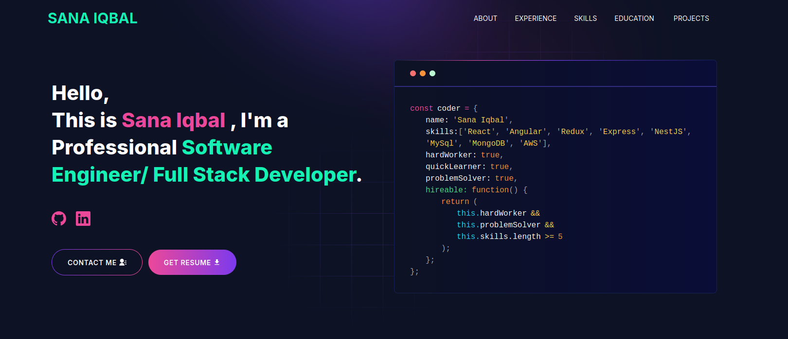

# Portfolio - Sana Iqbal

<p align="center">
  
</p>

A modern, responsive portfolio website built with Next.js 15, showcasing my work, skills, and experience as a Software Engineer and Full Stack Developer.

## 🌟 Features

- **Modern Design**: Clean, professional UI with smooth animations
- **Responsive**: Fully responsive design that works on all devices
- **Fast Performance**: Optimized with Next.js 15 and React 19
- **Dynamic Content**: Fetches blog posts from dev.to automatically
- **Interactive Sections**: 
  - Hero section with animated Lottie graphics
  - Skills showcase with technology icons
  - Project portfolio with detailed descriptions
  - Experience timeline
  - Education history
  - Contact form with email integration

## 🚀 Tech Stack

- **Framework**: Next.js 15.1.1
- **UI Library**: React 19.0.0
- **Styling**: Tailwind CSS + SASS
- **Animations**: Lottie React
- **Icons**: React Icons
- **Form Handling**: React Toastify, EmailJS
- **Deployment**: Vercel-ready

## 📋 Sections

- **Hero Section**: Introduction with animated graphics
- **About Me**: Personal description and background
- **Experience**: Professional work experience timeline
- **Skills**: Technology stack and tools
- **Projects**: Featured projects with descriptions and links
- **Education**: Academic background
- **Contact**: Contact form and social media links

## 🛠️ Installation

### Prerequisites

- Node.js (v18 or higher)
- npm or yarn
- Git

### Setup

1. **Clone the repository**:
   ```bash
   git clone https://github.com/sanaiqbal5/portfolio.2.git
   cd portfolio.2
   ```

2. **Install dependencies**:
   ```bash
   npm install
   # or
   yarn install
   ```

3. **Run the development server**:
   ```bash
   npm run dev
   # or
   yarn dev
   ```

4. **Open your browser**:
   Navigate to [http://localhost:3000](http://localhost:3000)

## ⚙️ Configuration

### Environment Variables (Optional)

Create a `.env` file in the root directory for optional features:

```env
NEXT_PUBLIC_GTM=your_google_tag_manager_id
NEXT_PUBLIC_APP_URL=your_app_url
TELEGRAM_BOT_TOKEN=your_telegram_bot_token
TELEGRAM_CHAT_ID=your_telegram_chat_id
GMAIL_PASSKEY=your_gmail_app_password
EMAIL_ADDRESS=your_email_address
```

**Note**: The portfolio works without these variables. They're only needed for:
- Google Tag Manager analytics
- Telegram notifications for contact form
- Email functionality

### Personalize Your Portfolio

Update your personal information in `utils/data/personal-data.js`:

```javascript
export const personalData = {
  name: "Your Name",
  profile: '/profile.JPEG',
  designation: "Your Title",
  description: "Your description...",
  email: 'your.email@example.com',
  phone: '+1234567890',
  address: 'Your Location',
  github: 'https://github.com/yourusername',
  linkedIn: 'https://www.linkedin.com/in/yourprofile',
  devUsername: "your-devto-username",
  resume: "your-resume-link",
};
```

The `devUsername` is used to automatically fetch your blog posts from dev.to.

## 🐳 Docker Support

### Using Docker Compose

```bash
docker-compose up --build
```

### Using Dockerfile

```bash
# Development
docker build -t portfolio-dev -f Dockerfile.dev .
docker run -p 3000:3000 portfolio-dev

# Production
docker build -t portfolio-prod -f Dockerfile.prod .
docker run -p 3000:3000 portfolio-prod
```

## 🚀 Deployment

### Deploy to Vercel (Recommended)

1. **Push your code to GitHub**:
   ```bash
   git add .
   git commit -m "Ready for deployment"
   git push origin main
   ```

2. **Deploy via Vercel Dashboard**:
   - Go to [vercel.com](https://vercel.com)
   - Sign in with GitHub
   - Click "Add New Project"
   - Import your repository (`portfolio.2`)
   - Vercel will auto-detect Next.js settings
   - Add environment variables if needed
   - Click "Deploy"

3. **Deploy via Vercel CLI**:
   ```bash
   npm i -g vercel
   vercel login
   vercel --prod
   ```

### Deploy to Netlify

1. **Sign up** at [netlify.com](https://www.netlify.com)
2. **Connect GitHub** and select your repository
3. **Configure build settings**:
   - Build command: `npm run build`
   - Publish directory: `.next`
4. **Add environment variables** in Site Settings
5. **Deploy**

## 📦 Available Scripts

- `npm run dev` - Start development server
- `npm run build` - Build for production
- `npm run start` - Start production server
- `npm run lint` - Run ESLint

## 🎨 Customization

### Update Projects

Edit `utils/data/projects-data.js` to add or modify your projects.

### Update Skills

Modify `utils/data/skills.js` to showcase your technology stack.

### Update Experience & Education

Edit `utils/data/experience.js` and `utils/data/educations.js` respectively.

### Styling

- Global styles: `app/css/globals.scss`
- Component styles: `app/css/card.scss`
- Tailwind config: `tailwind.config.js`

## 📚 Dependencies

### Core
- `next` - React framework
- `react` & `react-dom` - UI library
- `tailwindcss` - CSS framework
- `sass` - CSS preprocessor

### Features
- `lottie-react` - Animations
- `react-icons` - Icon library
- `react-toastify` - Toast notifications
- `@emailjs/browser` - Email service
- `react-fast-marquee` - Scrolling animations
- `react-google-recaptcha` - Form validation
- `@next/third-parties` - Third-party integrations

## 🔧 Build Fixes

This project includes fixes for:
- ✅ SSR (Server-Side Rendering) compatibility
- ✅ Dynamic page rendering for optimal performance
- ✅ Client-side Google Tag Manager integration
- ✅ Error handling for external API calls

## 📝 License

This project is private and personal.

## 👤 Author

**Sana Iqbal**

- GitHub: [@sanaiqbal-siqbal](https://github.com/sanaiqbal-siqbal)
- LinkedIn: [Sana Iqbal](https://www.linkedin.com/in/sana-iqbal-43b947212/)
- Email: sana.iqbal.siqbal@gmail.com
- Location: Lahore, Pakistan

## 🙏 Acknowledgments

- Built with [Next.js](https://nextjs.org/)
- Styled with [Tailwind CSS](https://tailwindcss.com/)
- Icons from [React Icons](https://react-icons.github.io/react-icons/)
- Animations from [Lottie](https://lottiefiles.com/)

---

⭐ If you find this portfolio helpful, feel free to fork and customize it for your own use!
